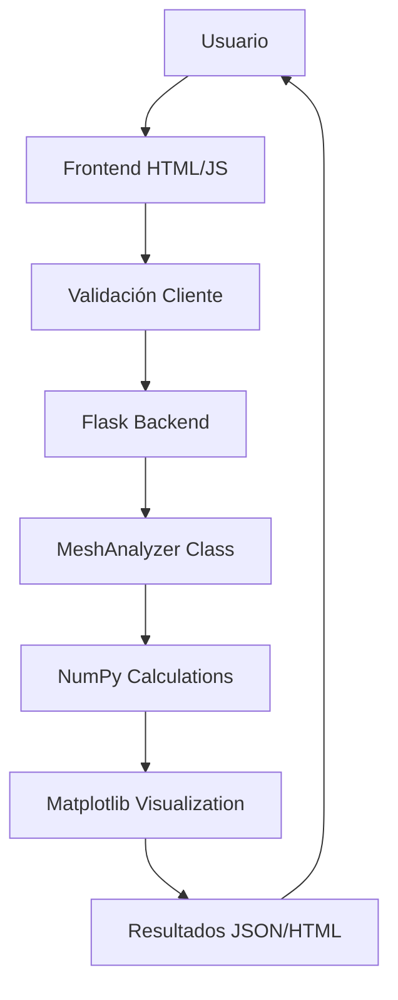

# Simulación de Circuitos Eléctricos en Mallas

> **Aplicación web profesional para análisis de circuitos residenciales utilizando el método de mallas de Kirchhoff**

## Tabla de Contenidos

- [Descripción General](#descripción-general)
- [Características Principales](#características-principales)  
- [Tecnologías](#tecnologías)
- [Arquitectura del Proyecto](#arquitectura-del-proyecto)
- [Instalación](#instalación)
- [Uso](#uso)
- [API REST](#api-rest)
- [Metodología Técnica](#metodología-técnica)
- [Validaciones](#validaciones)
- [Despliegue](#despliegue)
- [Casos de Uso](#casos-de-uso)
- [Contribución](#contribución)

## Descripción General

Esta aplicación web permite el análisis matemático y la simulación visual de circuitos eléctricos residenciales mediante el **método de análisis de mallas**. Diseñada para ingenieros eléctricos, estudiantes y profesionales que necesitan optimizar sistemas de distribución de energía en instalaciones residenciales.

### Problema que Resuelve

- **Análisis de circuitos complejos**: Calcula corrientes en cada malla del circuito
- **Optimización energética**: Identifica cargas y distribución de corriente
- **Verificación de diseños**: Valida instalaciones antes de implementación
- **Educación técnica**: Herramienta didáctica para enseñanza de circuitos

### Demo en Vivo

🔗 **URL del proyecto**: [https://github.com/runer0101/simulacion_mallas](https://github.com/runer0101/simulacion_mallas)

## Características Principales

### 🎯 Funcionalidades Core

- **Cálculo Matemático Avanzado**: Resolución de sistemas de ecuaciones lineales mediante álgebra matricial
- **Visualización Dinámica**: Generación automática de diagramas de circuito con Matplotlib
- **Validación Robusta**: Verificación de parámetros tanto en frontend como backend
- **Interpretación Inteligente**: Análisis automático de resultados con recomendaciones
- **API REST Completa**: Endpoints para integración con sistemas externos

### 🎨 Experiencia de Usuario

- **Interfaz Responsiva**: Optimizada para dispositivos móviles y desktop
- **Matemáticas Renderizadas**: Ecuaciones LaTeX con MathJax para claridad visual
- **Validación en Tiempo Real**: Feedback inmediato durante entrada de datos
- **Explicación Paso a Paso**: Desglose completo del proceso matemático
- **Exportación de Datos**: Resultados en CSV para análisis posterior

## Tecnologías

### Backend
```
Python 3.8+
Flask 2.0+           # Framework web minimalista
NumPy 1.21+          # Cálculos matriciales y álgebra lineal
Matplotlib 3.5+      # Generación de diagramas de circuito
```

### Frontend
```
HTML5                # Estructura semántica
CSS3                 # Diseño responsivo con Flexbox/Grid
JavaScript ES6+      # Interactividad y validación
MathJax 3.0+         # Renderizado de ecuaciones LaTeX
```

### Herramientas
```
Git                  # Control de versiones
GitHub               # Repositorio y colaboración
Jinja2               # Motor de plantillas
```

## Arquitectura del Proyecto

```
simulacion_mallas/
├── 📁 app.py                    # 🚀 Aplicación Flask principal
├── 📁 static/
│   ├── 🎨 styles.css           # Estilos CSS responsivos
│   └── ⚡ main.js              # JavaScript interactivo
├── 📁 templates/
│   └── 🌐 index.html           # Plantilla principal Jinja2
├── 📁 .venv/                   # Entorno virtual Python
├── 📄 .gitignore               # Configuración Git
└── 📋 README.md                # Documentación del proyecto
```

### Flujo de Datos



## Instalación

### Prerrequisitos

- **Python 3.8+**
- **pip** (gestor de paquetes)
- **Git**

### Configuración Local

```bash
# 1. Clonar repositorio
git clone https://github.com/runer0101/simulacion_mallas.git
cd simulacion_mallas

# 2. Crear entorno virtual
python -m venv .venv

# 3. Activar entorno virtual
# Windows:
.venv\Scripts\activate
# Linux/Mac:
source .venv/bin/activate

# 4. Instalar dependencias
pip install flask numpy matplotlib

# 5. Ejecutar aplicación
python app.py
```

### Variables de Entorno (Opcional)

```bash
# Para producción
export FLASK_ENV=production
export FLASK_DEBUG=False
```

## Uso

### Interfaz Web

1. **Acceder**: Navegar a `http://localhost:5000`
2. **Ingresar Parámetros**:
   - **Resistencias**: R1-R6 (0.01-1000 Ω)
   - **Voltajes**: V1-V3 (1-500 V)
3. **Calcular**: Presionar botón "Calcular" para obtener resultados
4. **Interpretar**: Revisar corrientes I1, I2, I3 y análisis automático

### Valores de Ejemplo

La aplicación incluye valores predefinidos para un circuito residencial típico:

```
Resistencias: R1=2Ω, R2=4Ω, R3=3Ω, R4=6Ω, R5=5Ω, R6=2Ω
Voltajes: V1=12V, V2=0V, V3=0V
```

## API REST

### Endpoints Disponibles

#### Calcular Corrientes
```http
POST /api/calculate
Content-Type: application/json

{
  "R1": 2.0, "R2": 4.0, "R3": 3.0,
  "R4": 6.0, "R5": 5.0, "R6": 2.0,
  "V1": 12.0, "V2": 0.0, "V3": 0.0
}
```

**Respuesta**:
```json
{
  "success": true,
  "currents": {"I1": 1.234, "I2": 0.567, "I3": 0.890},
  "matrix_A": [[...], [...], [...]],
  "vector_B": [12.0, 0.0, 0.0],
  "interpretations": {...}
}
```

#### Obtener Valores de Ejemplo
```http
GET /api/example
```

#### Generar Diagrama del Circuito
```http
GET /circuito.png?R1=2.0&R2=4.0&R3=3.0&R4=6.0&R5=5.0&R6=2.0&V1=12.0
```

## Metodología Técnica

### Fundamento Matemático

La aplicación implementa el **Método de Análisis de Mallas** basado en las Leyes de Kirchhoff:

#### Sistema de Ecuaciones
```
(R1+R4+R6)×I1 - R4×I2 - R6×I3 = V1
-R4×I1 + (R2+R4+R5)×I2 - R5×I3 = V2  
-R6×I1 - R5×I2 + (R3+R5+R6)×I3 = V3
```

#### Resolución Matricial
- **Matriz A**: Coeficientes según topología del circuito
- **Vector B**: Voltajes independientes por malla
- **Solución**: `I = A⁻¹ × B` usando NumPy

### Algoritmo de Cálculo

1. **Validación de parámetros** (rangos físicamente realistas)
2. **Construcción de matriz de coeficientes** A
3. **Verificación de sistema no-singular** (det(A) ≠ 0)
4. **Resolución por eliminación gaussiana**
5. **Interpretación de resultados** (magnitud y sentido)

## Validaciones

### Rangos de Parámetros
- **Resistencias**: 0.01Ω - 1000Ω
- **Voltajes**: 1V - 500V
- **Corrientes**: Alerta si > 1000A (carga crítica)

### Validaciones Técnicas
- **Matriz singular**: Verificación de determinante
- **Estabilidad numérica**: Precisión de punto flotante
- **Límites físicos**: Rangos de instalaciones residenciales

### Interpretación de Resultados

| Magnitud de Corriente | Clasificación |
|-----------------------|---------------|
| < 1A                  | Carga baja    |
| 1A - 10A              | Carga normal  |
| 10A - 50A             | Carga alta    |
| > 50A                 | Carga crítica |

**Sentido de Corriente**:
- **Positiva**: Sentido horario
- **Negativa**: Sentido antihorario

## Despliegue

### Plataformas Recomendadas

**Heroku** (Opción 1):
```bash
# Crear Procfile
echo "web: python app.py" > Procfile

# Deploy
heroku create simulacion-mallas-[usuario]
git push heroku main
```

**Railway/Render** (Opción 2):
- Conectar repositorio GitHub
- Deploy automático con SSL incluido

### Configuración de Producción

```python
# app.py - Configuración para producción
if __name__ == '__main__':
    import os
    port = int(os.environ.get('PORT', 5000))
    app.run(host='0.0.0.0', port=port, debug=False)
```

## Casos de Uso

### 🏠 Análisis Residencial
- Optimización de circuitos domésticos
- Dimensionamiento de conductores
- Verificación de cargas por zona

### 🎓 Educación Técnica
- Enseñanza de análisis de circuitos
- Problemas de ejemplo interactivos
- Visualización de conceptos abstractos

### 🔧 Ingeniería Profesional
- Verificación de diseños eléctricos
- Integración con software CAD
- Análisis de factibilidad

### 🔌 Investigación
- Simulación de escenarios de carga
- Optimización energética
- Estudios de eficiencia

## Contribución

### Cómo Contribuir

1. **Fork** del repositorio
2. **Crear rama** para nueva funcionalidad: `git checkout -b feature/nueva-funcionalidad`
3. **Commit** cambios: `git commit -m 'Agregar nueva funcionalidad'`
4. **Push** a la rama: `git push origin feature/nueva-funcionalidad`
5. **Abrir Pull Request**

### Estándares de Código

- **Python**: PEP 8, type hints, documentación
- **JavaScript**: ES6+, comentarios descriptivos
- **CSS**: BEM methodology, responsive design
- **Commits**: Conventional commits format

### Issues y Bugs

Para reportar problemas o sugerir mejoras, crear un issue en GitHub con:
- Descripción detallada del problema
- Pasos para reproducir
- Entorno de ejecución (OS, Python version)
- Screenshots si aplica

---

## Información del Proyecto

**Desarrollado por**: [runer0101](https://github.com/runer0101)  
**Licencia**: MIT License  
**Versión**: 2.0.0  
**Última actualización**: Agosto 2025

### Enlaces de Interés

- 📂 [Repositorio GitHub](https://github.com/runer0101/simulacion_mallas)
- 📧 Contacto: [Crear issue](https://github.com/runer0101/simulacion_mallas/issues)
- 📖 Documentación adicional: Ver `/templates/index.html` para explicación matemática completa

---

*Esta aplicación fue desarrollada como proyecto académico UPDS para la optimización de sistemas de distribución de energía en instalaciones residenciales.*

**Prerrequisitos:**
- Python 3.8 o superior
- `pip` y `venv`

**1. Clonar el Repositorio**
```bash
git clone https://github.com/runer0101/simulacion_mallas.git
cd simulacion_mallas
```

**2. Crear y Activar un Entorno Virtual**
- En Windows:
    ```bash
    python -m venv .venv
    .venv\Scripts\activate
    ```
- En macOS/Linux:
    ```bash
    python3 -m venv .venv
    source .venv/bin/activate
    ```

**3. Instalar las Dependencias**

```bash
pip install -r requirements.txt
```

Si no tienes el archivo `requirements.txt`, instala manualmente:
```bash
pip install Flask numpy matplotlib
```

**4. Ejecutar la Aplicación**
```bash
python app.py
```

La aplicación estará disponible en: `http://localhost:5000`

## Uso de la Aplicación

### Interfaz Web
1. **Ingresar parámetros del circuito:**
   - Resistencias (R1-R6) en Ohms
   - Voltajes (V1-V3) en Volts
2. **Hacer clic en "Calcular"** para obtener las corrientes I1, I2, I3
3. **Ver resultados** con interpretación automática y diagrama actualizado
4. **Usar "Cargar ejemplo"** para valores predefinidos del problema típico

### Valores de Ejemplo

**Problema Académico:**
```
R1=2Ω, R2=4Ω, R3=3Ω, R4=6Ω, R5=5Ω, R6=2Ω
V1=12V, V2=0V, V3=0V
Resultado: I1=2.296A, I2=1.406A, I3=1.262A
```

### API REST

**Calcular corrientes:**
```bash
POST /api/calculate
Content-Type: application/json

{
  "R1": 2.0, "R2": 4.0, "R3": 3.0,
  "R4": 6.0, "R5": 5.0, "R6": 2.0,
  "V1": 12.0, "V2": 0.0, "V3": 0.0
}
```

**Obtener valores de ejemplo:**
```bash
GET /api/example
```

**Generar diagrama del circuito:**
```bash
GET /circuito.png?R1=2.0&R2=4.0&R3=3.0&R4=6.0&R5=5.0&R6=2.0&V1=12.0&V2=0.0&V3=0.0
```

## Método de Análisis

La aplicación utiliza el **método de análisis de mallas** basado en las leyes de Kirchhoff:

### Sistema de Ecuaciones
```
(R1+R4+R6)×I1 - R4×I2 - R6×I3 = V1
-R4×I1 + (R2+R4+R5)×I2 - R5×I3 = V2  
-R6×I1 - R5×I2 + (R3+R5+R6)×I3 = V3
```

### Resolución Matricial
- **Matriz A**: Coeficientes de resistencias según topología del circuito
- **Vector B**: Voltajes independientes de cada malla
- **Solución**: I = A⁻¹ × B usando álgebra lineal (NumPy)

## Validaciones

- **Rangos de parámetros:** Resistencias (0.01-1000Ω), Voltajes (1-500V)
- **Validación de matrices:** Verificación de sistemas no singulares
- **Límites de corriente:** Alertas para corrientes superiores a 1000A
- **Manejo de errores:** Captura y logging de excepciones

## Interpretación de Resultados

### Magnitud de corriente:
- **< 1A:** Carga baja
- **1-10A:** Carga normal  
- **10-50A:** Carga alta
- **> 50A:** Carga crítica

### Sentido de corriente:
- **Positiva:** Sentido horario
- **Negativa:** Sentido antihorario

## Despliegue

### Opciones de Hosting

**Heroku:**
```bash
# Crear Procfile
echo "web: python app.py" > Procfile

# Deploy
heroku create simulacion-mallas-runer
git push heroku main
```

**Railway/Render:**
- Conecta tu repositorio GitHub
- Deploy automático
- SSL gratuito incluido

## Casos de Uso

1. **Análisis de instalaciones residenciales** reales
2. **Educación en ingeniería eléctrica** - problemas de ejemplo
3. **Verificación de diseños** eléctricos antes de implementación
4. **Integración con software** de diseño via API REST
5. **Simulación de cargas** en diferentes zonas de la vivienda

## Contribuciones

Las contribuciones son bienvenidas. Para contribuir:

1. Fork del proyecto
2. Crear rama feature: `git checkout -b feature/nueva-caracteristica`
3. Commit cambios: `git commit -m 'Descripción del cambio'`
4. Push a la rama: `git push origin feature/nueva-caracteristica`
5. Abrir Pull Request

## Licencia

Este proyecto está bajo la Licencia MIT. Consulta el archivo `LICENSE` para más detalles.

---

**Desarrollado por:** runer0101  
**Versión:** 1.2.0  
**Última actualización:** Julio 2025  
**Python:** 3.8+ requerido